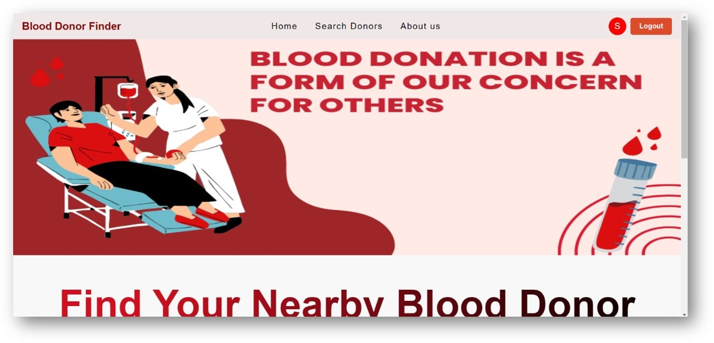

# Blood-Donor-Finder
## 🌟 Description
The Virtual Blood Donor Finder is a web-based application designed to connect blood donors and recipients in a convenient and efficient manner. The platform allows users to login, search for nearby blood donors, and register themselves as blood donors. Recipients who immediately want a blood donor nearby of their location , a blood donor who wants to donate and help recipients , healthcare professionals can easily use this web-application by simply login in with their credentials.The Virtual Blood Donor Finder takes a quick check by making it  easy for you to find your nearby blood donors.​
## 🛠️ Technologies Used
- PHP
- MySQL
- HTML
- CSS
- JS
## 📸 Screenshots

